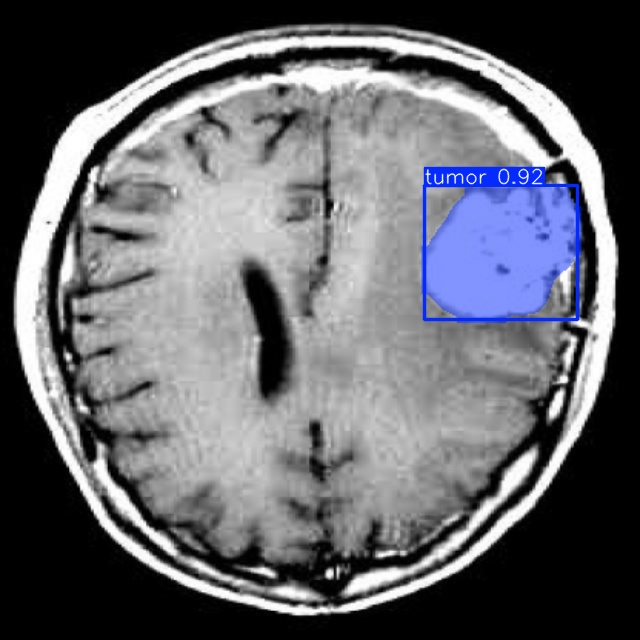

# Brain Tumor Detection with YOLO

### Author: Virendrasinh Chavda

This repository contains a deep learning-based project for detecting and segmenting brain tumors from MRI scans using the YOLO framework. The project is designed to assist radiologists and medical professionals by automating the detection of tumors with high accuracy and reliability.

---

## Table of Contents
1. [Overview](#overview)
2. [Installation](#installation)
3. [Data](#data)
4. [Features](#features)
5. [Visualizations](#visualizations)
6. [Model Details](#model-details)
7. [Training Process](#training-process)
8. [Results](#results)
9. [Future Work](#future-work)
10. [Contributing](#contributing)
11. [License](#license)

---

## Overview

Early detection of brain tumors is critical for improving patient outcomes. This project uses the YOLO object detection and segmentation model to identify brain tumors in MRI scans. By leveraging advanced neural networks, the system can accurately localize and highlight tumor regions, providing confidence scores for each prediction.

The trained model is robust across various MRI images, showcasing its ability to generalize across different tumor shapes, sizes, and locations.

---

## Installation

To set up the project, clone the repository and install the required dependencies listed in the `requirements.txt` file. Run the Jupyter Notebook `training.ipynb` to train or evaluate the YOLO segmentation model. The pre-trained model weights (`yolo11n-seg.pt`) can also be used for inference.

---

## Data

The dataset consists of MRI scans annotated with tumor regions. Key features of the dataset include:

- **MRI Images**: High-resolution brain scans.
- **Tumor Annotations**: Segmentation masks and bounding boxes for tumor regions.

The dataset was preprocessed to normalize image intensities and match the input requirements of the YOLO model.

---

## Features

### YOLO Segmentation Model
- Combines object detection and segmentation capabilities.
- Accurately localizes and segments tumor regions in MRI scans.

### Visualizations
- **Detection Results**: Includes bounding boxes and segmentation masks for tumors.
- **Confidence Scores**: Displays the model's confidence in its predictions.

### Pre-trained Weights
- Includes a pre-trained model (`yolo11n-seg.pt`) for quick inference without retraining.

---

## Visualizations

The following images showcase the model's ability to detect and segment brain tumors:

#### Example 1
- The model successfully detects and segments a tumor with a confidence score of 0.70.

  

#### Example 2
- The model identifies a tumor with a confidence score of 0.85.

  

#### Example 3
- The model detects and highlights a tumor with a confidence score of 0.92.

  

#### Example 4
- A tumor detection with a confidence score of 0.91.

  

#### Example 5
- The model identifies a tumor with a confidence score of 0.90.

  

#### Example 6
- Another detection with a confidence score of 0.84.

  

These examples demonstrate the model's ability to accurately detect and segment tumors in a variety of scenarios.

---

## Model Details

### YOLO Model Version
This project utilizes **YOLOv5 (Segmentation Variant)** for tumor detection and segmentation. YOLOv5 is an advanced object detection framework known for its speed and accuracy, making it suitable for real-time medical applications. The segmentation variant combines object detection with pixel-wise segmentation to provide more detailed tumor localization.

### Key Features of YOLOv5:
1. **Real-time Speed**: High FPS performance enables fast inference on MRI scans.
2. **Segmentation Capabilities**: Enhances object detection by generating precise tumor masks.
3. **Transfer Learning**: Fine-tuned the pre-trained weights on the custom brain tumor dataset.
4. **Scalable Architecture**: Model sizes range from small (YOLOv5n) to extra-large (YOLOv5x) for flexibility in computational requirements.

---

## Training Process

### Preprocessing:
- **Data Augmentation**: Applied transformations such as flipping, rotation, and brightness/contrast adjustments to enhance model generalization.
- **Normalization**: Standardized pixel intensities to ensure consistent inputs for the model.
- **Segmentation Masks**: Prepared binary masks for tumor regions to enable pixel-wise segmentation.

### Training Setup:
- **Model Architecture**: YOLOv5n (lightweight version) with segmentation capabilities.
- **Optimizer**: Adam optimizer was used with a learning rate scheduler to fine-tune weights effectively.
- **Loss Function**:
  - **Bounding Box Loss**: Calculates error in tumor location predictions.
  - **Segmentation Loss**: Binary cross-entropy loss for segmentation masks.
- **Hardware**: Training was performed on a GPU-enabled environment for faster processing.

### Training Parameters:
- **Epochs**: The model was trained for 50 epochs with early stopping to prevent overfitting.
- **Batch Size**: A batch size of 16 was used to optimize memory utilization and training speed.
- **Learning Rate**: The learning rate was initialized at 0.001 and decayed progressively during training.
- **Validation**: 20% of the data was set aside as a validation set to monitor model performance during training.

### Evaluation:
- **Metrics**:
  - **Mean Average Precision (mAP)**: Evaluates overall detection accuracy.
  - **Intersection over Union (IoU)**: Measures overlap between predicted masks and ground truth.
  - **Precision and Recall**: Tracks the trade-off between false positives and false negatives.

---

## Results

The model demonstrates high accuracy in detecting and segmenting tumors in MRI scans. Key performance metrics include:

- **Precision**: Measures the proportion of correctly identified tumor regions.
- **Recall**: Measures the model's ability to detect all relevant tumor regions.
- **Confidence Scores**: High confidence values (e.g., 0.70, 0.85, 0.92) indicate reliable predictions.

The visualizations above further illustrate the model's effectiveness in clinical scenarios.

---

## Future Work

1. **Model Enhancement**:
   - Train the YOLO model on a larger and more diverse dataset.
   - Experiment with advanced YOLO versions for improved segmentation accuracy.

2. **Deployment**:
   - Develop a real-time application for automated MRI analysis in clinical settings.

3. **Integration**:
   - Incorporate additional diagnostic tools, such as tumor grading and volume estimation.

---

## Contributing

Contributions are welcome! Feel free to fork the repository, make improvements, and submit a pull request. If you encounter any issues, please open a GitHub issue for discussion.

---

## License

This project is licensed under the MIT License. See the [LICENSE](./LICENSE) file for more details.
